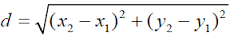

# Objectif

En montagne, on utilise des cartes topographiques qui contiennent des courbes de niveau. Tous les points d'une courbe de niveau donnée sont à la même altitude. Par conséquent, si une courbe de niveau en croise une autre cela constitue une anomalie (sinon le point de croisement aurait deux altitudes différentes). Dans ce challenge, vous allez devoir déterminer si une carte contient ou non une anomalie.

Pour simplifier le problème, on va considérer que les courbes de niveau sont des cercles dont on vous fournit les coordonnées du centre ainsi que le rayon. Toutes les courbes de niveau que l'on vous fournit représentent des altitudes différentes donc si deux lignes se touchent, c'est aussi une anomalie.

Petit rappel mathématique, la distance entre 2 points de coordonnées (x1,y1) et (x2,y2) est donnée par :

# Données

##### Entrée
Ligne 1 : un entier N compris entre 2 et 1500 représentant le nombre de cercles.

Lignes 2 à N + 1 : trois entiers X, Y, et R séparés par des espaces représentant respectivement l'abscisse(X) et l'ordonnée(Y) du centre et le rayon(R) d'un cercle.

##### Sortie
La chaîne OK si la carte ne contient pas d'anomalie sinon la chaîne KO.
