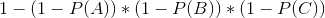

# Objectif

Le but de ce challenge est de trouver le chemin le moins risqué entre deux sommets. Chaque piste relie deux sommets et le risque d'avalanche de la piste est P. Chaque sommet est relié à tous les autres sommets par une piste. Par ailleurs, les probabilités d'avalanche sont indépendantes.

##### Petit rappel statistique

Si on note P(A), P(B) et P(C) les risques d'avalanche des pistes A, B et C, alors la probabilité qu'il n'y ait pas d'avalanche sur les pistes A, B et C sont respectivement 1-P(A), 1-P(B), 1-P(C). Comme les probabilités sont indépendantes, la probabilité qu'il n'y ait pas d'avalanche sur un parcours où le skieur emprunterait successivement les pistes A, B et C est :

Par conséquent, la probabilité qu'il y ait au moins une avalanche sur un parcours où le skieur emprunterait successivement les pistes A, B et C est :

Une solution brutale force dont la complexité serait systématiquement O(n!) (c'est à dire explorant tous les chemins possibles) génèrera un timeout.

# Données

##### Entrée
Ligne 1 : un entier N compris entre 1 et 200 représentant le nombre de sommets.

Ligne 2 : deux entiers différents A et B compris entre 0 et N - 1, le numéro du sommet de départ et le numéro du sommet d'arrivée.

Lignes 3 à N + 2 : N nombres décimaux compris entre 0 et 1, séparés par des espaces. Si on nomme i le numéro de la ligne - 3, alors le j-ème nombre de la ligne représente la probabilité d'avalanche entre le sommet i et le sommet j-1.

##### Sortie
Un nombre décimal arrondi à 3 chiffres après la virgule représentant la probabilité qu'il y ait au moins une avalanche sur le chemin le moins risqué pour relier le sommet A au sommet B.
