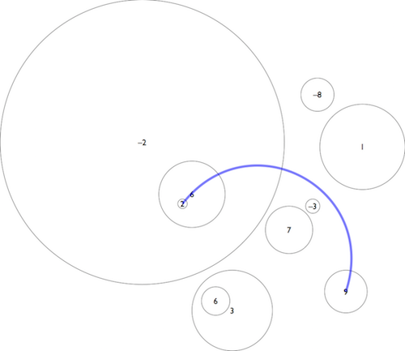

# Objectif

Le but de ce challenge est de trouver le parcours avec le plus grand dénivelé sur un champ de bosses. On vous donne une carte topographique où les bosses et les trous sont représentés par des disques. Chaque disque a une hauteur (positive) ou une profondeur (négative). Les bosses et les trous peuvent être empilés, par contre leurs périmètres ne se croisent jamais.

Un skieur qui passe d'un disque de hauteur ou profondeur A à un disque de hauteur ou profondeur B encaisse un dénivelé de |A - B| (valeur absolue de A - B). Or, un grand dénivelé, c'est cool. Vous devez trouver le chemin le plus cool, c'est-à-dire celui qui réalise un dénivelé maximal, sans passer deux fois par le même disque.

Si le skieur passe par la zone qui n'est comprise dans aucun disque alors il est à une hauteur de 0 et il ne peut passer qu'une seule fois dans cette zone. Par ailleurs, le skieur est agile donc il sait tourner pour contourner un disque si cela est nécessaire.

Cet exercice peut être résolu en O(N log N), néanmoins pour ce concours, une solution en O(N^2) est acceptée.

# Exemple

Dans l'exemple ci-dessus le parcours optimal est de passer par les points de hauteur suivante : 2 -> 6 -> -2 -> 0 -> 9 et correspond à un dénivelé de 23.

# Données

##### Entrée
Ligne 1 : un entier N compris entre 1 et 1000 représentant le nombre de disques.

Lignes 2 à N + 1 : quatre entiers X, Y, R, et H séparés par des espaces représentant respectivement l'abscisse (X) et l'ordonnée (Y) du centre, le rayon (R) et la hauteur H (positive) ou profondeur (négative) d'un disque. X, Y et R sont compris entre 1 et 100000. H est compris entre -100000 et 100000.

##### Sortie
Un entier, représentant le dénivelé maximal que l'on peut obtenir en se baladant sur la piste sans passer deux fois par le même disque et en passant au maximum une fois par la zone qui n'est comprise dans aucun disque.
